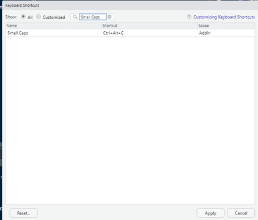

# Functions for Vowel Covariation Studies

**This package is an early stage of development. Function definitions are subject to change.**

This R package is designed to make it easier to carry out analysis of monophthong covariation. 

The package is written in a `tidyverse` style. Plotting functions produce ggplot objects, which can be modified by the user in the usual ggplot fashion. PCA visualisations use functions from the `factoextra` package. The functions to fit by-vowel models, by default, use `mgcv`.

The origin of these functions is in work towards [Brand et al. (2021)](https://www.sciencedirect.com/science/article/pii/S0095447021000711)
and Wilson Black et al. (under review), carried out at the New Zealand Institute of Language, Brain and Behaviour and the University of Canterbury.

## Packaged Data

The package includes two pairs of datasets. One is designed to allow exploration of analysis in the style of Brand et al. (2021), the second is designed to follow the analysis of Wilson Black et al. (2022).

1. A sample of 100 speakers from ONZE.
	- `onze_vowels`: the mean F1 and F2 values for 100 speakers in the ONZE corpus, with 50 born at or before 1920 and 50 after.
	- `onze_intercepts`: random intercepts for the 100 speakers in `onze_means`. Intercepts generated by Brand et al. (2021).
2. A sample of 77 speakers from QuakeBox, with 11 in each age category.
	- `qb_vowels`: vowel tokens for speaker monologues after filtering to remove unstressed tokens, stop words, and outliers.
	- `qb_intervals`: monologues divided into 60 and 240 second intervals for the same speakers as `qb_vowels`.

It is recommended to use these datasets in order to try out methods. We do not
recommend that these are directly used for research. Full anonymised datasets
are given in supplementary data for Brand et al. (2021) and Wilson Black et al.
(under review). If you are interested in research on the basis of the ONZE or
QuakeBox corpora, contact [NZILBB](https://www.canterbury.ac.nz/nzilbb/).

## Functions

## `lobanov_2`

Apply Lobanov 2.0 normalisation as developed in Brand et al. (2021). This
variant of Lobanov normalisation is designed to work for datasets whether the
vowel types have different token counts from one another. The Lobanov 2.0 value
for a vowel is given by:

$$F_{lobanov2.0_i} = \frac{F_{raw_i} - \mu(\mu_{vowel_1}, \ldots, \mu_{vowel_n})}{\sigma(\mu_{vowel_1}, \ldots, \mu_{vowel_n})}$$
Where, for ease of notation, we assume all values are from a single speaker. 
We signify the $n$ vowel types as $vowel_1, \ldots, vowel_2$, while $i$
indicates the formant number. We implement the function for $F_1$ and $F_2$.

### `pca_contrib_plot`

Take a PCA object produced by `prcomp` and plot a PC by the percentage
contribution of the original variables to the PC. For instance:

A cutoff value of 50% is given by default. This highlights the collection of
highest-contribution variables which account for 50% of the PC in question. This
can be turned off by setting `cutoff = NULL`.

The PC to plot is selected by the argument `pc_n`.

### `permutation_test`

This function runs a permutation test on a PCA analysis. Given data in a format
acceptable by `prcomp` (a data frame with all numeric columns), the function
repeats the analysis on `n` permutations of the data in each column. It
returns an S3 object with attributes:

* `$permuted_variances` `n` x `pc_no` matrix of variances explained by first
`pc_no` PCs in `n` permutations of original data.
* `$permuted_correlations` list of length `n` of significant pairwise
correlations in `n` permutations of the data (<= 0.05).
* `$actual_variances` `pc_n` x 2 tibble of variances explained by first `pc_n`
PCs with original data.
* `$actual_correlations` the number of significant pairwise correlations (<=
0.05) in the original data.

### `plot_permutation_test`

Plots the results of the permutation test. If argument `violin` is set to
`FALSE`, then a the values for each permutation are connected with a line.

For instance:

The plots for the number of significant correlations and for variance explained
by each PC are joined together using the `patchwork` library.

_In the near future, this will be turned into a generic plot for the `permutation_test` class_

### PCA Vowel Space Visualisation

**TODO**

### Fit Per-Vowel Models

**TODO**

### Extract By-Speaker Intercepts

**TODO**

## RStudio Addin

It is often useful to have Wells lexical sets in small capitals in R Markdown
documents. The way to achieve this manually is to add "vowel". This package includes an
RStudio add in, which can be attached to a keyboard shortcut, to quickly include
this code within an R Markdown document. For instance:

